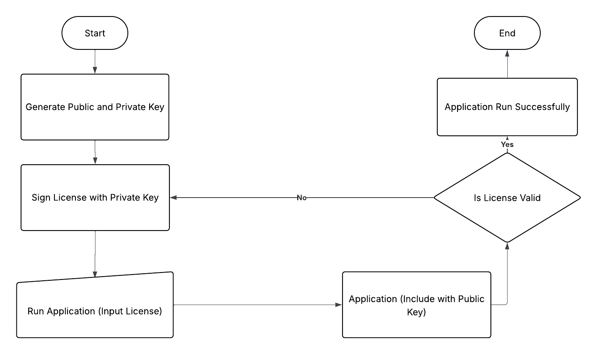

# 03u502u502
License3J Tutorial for Baby

## What is License3J?
Read this, https://github.com/verhas/License3j.

## Why should i use license for my application
What a "wah" question.

## Flowchart
Can't read it?, Maybe you need some help dude.

### Generate Public and Private Key
To lazy to write about it
1. Run License3J REPL with `java -jar License3jrepl-3.1.5-jar-with-dependencies.jar` command
2. Run this command `generateKeys algorithm=RSA size=1024 format=BINARY public=public.key private=private.key
   `, this command will generate Public and Private Key.
3. Load the public key, `loadPublicKey fileName`.
4. Dump the key into Byte Array, `dumpPublicKey fileName`. this command will return an array byte, put the publicKey into your code

### Sign License with Private Key
To lazy to write about it
1. Run License3J REPL
2. Load Public Key
3. Run `newLicense` to generate new License File
   1. Add information to your license like expirationDate, Mac Address, etc
   2. Run `feature fieldName:TYPE=value`
   3. Sign the key, `sign [digest=SHA-512]`
   4. Save the license, `saveLicense [format=TEXT*|BINARY|BASE64] fileName`

### Run Application (Input License)
To lazy to write about it

### Application (Include with Public Key)
To lazy to write about it

### License Validation
To lazy to write about it